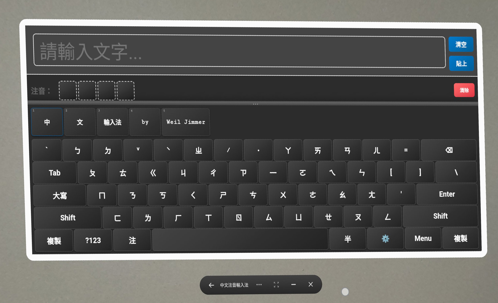
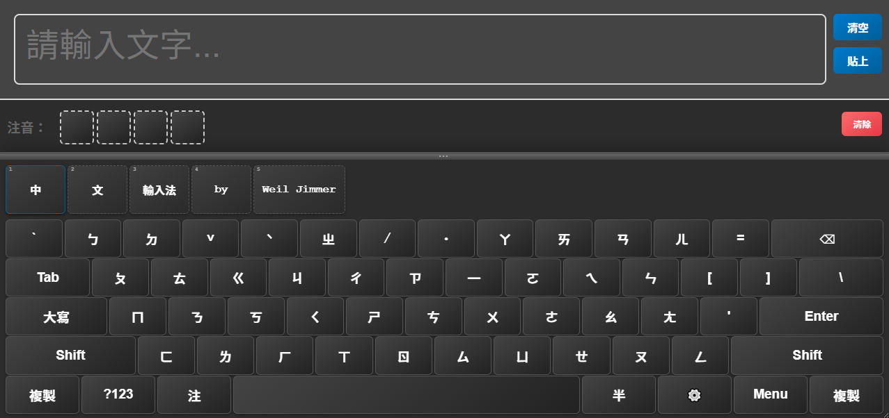
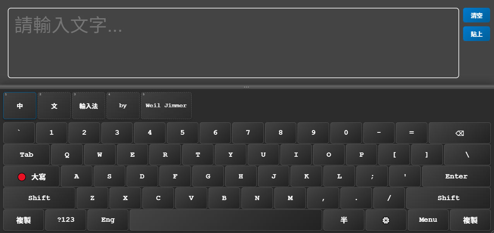
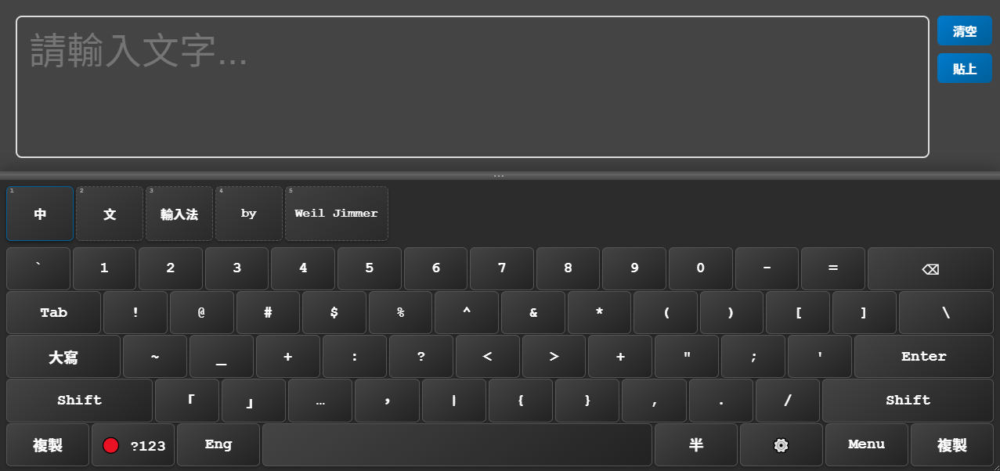
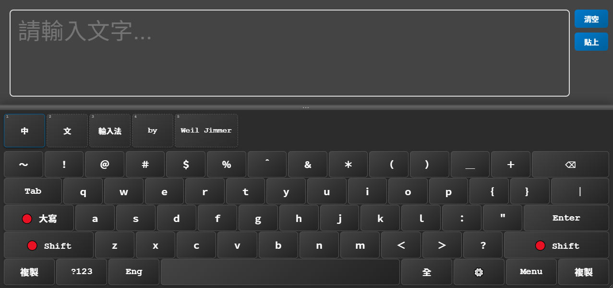

# Chinese Input Keyboard VR App

**Chinese Zhuyin Input Keyboard for VR (Android App)**  
為 **Meta Quest 3** 打造的 **中文注音輸入鍵盤** App，方便您快速複製中文內容並貼上到其他應用。

目前仍在開發新功能中，歡迎試用與回饋！

---

## 🎥 示範影片

  
_點擊上圖觀看影片示範_

---

## 🖼️ 截圖預覽

| 鍵盤配置一 | 鍵盤配置二 |
|--------|--------|
|  |  |

| 鍵盤配置三 | 鍵盤配置四 |
|--------|--------|
|  |  |

---

## ✨ 目前功能

- ✅ 支援 **注音輸入法**
- ✅ 可在 **半形 / 全形** 模式間切換
- ✅ 英文輸入支援 **SHIFT** 與 **大寫鎖定（Caps Lock）**
- ✅ 包含常用 **符號鍵盤**
- ✅ 內建複製 / 貼上功能，便於應用內傳輸文字
- ✅ **候選詞路徑優化**，提高選字效率
- ✅ 可以自由縮放應用程式的寬度和高度 / 自由拖曳鍵盤高低尺寸

---

## 🔮 未來規劃（開發中）

- ✅ 加強根據使用頻率優化路徑的演算法
- ✅ 聯想詞建議（類似輸入法智能提示）
- 🔲 支援簡體中文模式
- 🔲 設定選單（切換語言、UI 偏好等）
- 🔲 （考慮中）拼音輸入法

---

## 🔧 安裝方式

1. 下載 [APK](https://github.com/WeilJimmer/ChineseInputKeyboardVRApp/releases) 至你的 Meta Quest 3 裝置
2. 使用 SideQuest 或 ADB 安裝
3. 啟動應用後即可使用中文注音鍵盤

---

## 📄 授權 License

本專案使用 [BSD 3-Clause License](LICENSE)。

歡迎自由使用、修改與發佈，唯需保留原始授權聲明。

---

## 🛠️ 開發與貢獻

目前為個人開發專案，說明文件仍在整理中。  
如果你對 VR 輸入法、中文處理、Android VR 開發有興趣，歡迎：

- 提出建議（開 Issue）
- 修正問題（Pull Request）
- 討論功能或參與協作！
